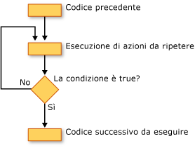

# Strutture di ciclo (Visual Basic)
Visual Basic cicli (strutture) consentono di eseguire ripetutamente una o più righe di codice. È possibile ripetere le istruzioni in una struttura di ciclo finché una condizione è `True`, fino a quando non è una condizione `False`, un numero di volte o una volta per ogni elemento specificato in una raccolta.  
  
 Nella figura seguente mostra una struttura di ciclo che esegue una serie di istruzioni finché una condizione non diventa true.  
  
   
Esecuzione di un set di istruzioni finché una condizione non diventa true  
  
## Cicli while  
 Il `While`... `End While` esegue un set di istruzioni fino a quando la condizione specificata nel `While` istruzione `True`. Per ulteriori informazioni, vedere [mentre... End While (istruzione)](../../../../visual-basic/language-reference/statements/while-end-while-statement.md).  
  
## Cicli Do  
 Il `Do`... `Loop` costruzione consente di testare una condizione all'inizio o fine di una struttura di ciclo. È anche possibile specificare se ripetere il ciclo mentre la condizione rimane `True` o finché diventa `True`. Per ulteriori informazioni, vedere [si... Istruzione di ciclo](../../../../visual-basic/language-reference/statements/do-loop-statement.md).  
  
## Per i cicli  
 Il `For`... `Next` esegue il ciclo di un determinato numero di volte per. Viene utilizzata una variabile di controllo del ciclo, detta anche un *contatore*, per tenere traccia delle ripetizioni. Specificare i valori iniziale e finale per questo contatore e, facoltativamente, è possibile specificare la quantità di cui aumenta da una ripetizione al successivo. Per ulteriori informazioni, vedere [per... Istruzione successiva](../../../../visual-basic/language-reference/statements/for-next-statement.md).  
  
## Cicli For Each  
 Il `For Each`... `Next` esegue un set di istruzioni una volta per ogni elemento in una raccolta. Specificare la variabile di controllo, ma non è necessario determinare i valori iniziale e finale per tale. Per ulteriori informazioni, vedere [For Each... Istruzione successiva](../../../../visual-basic/language-reference/statements/for-each-next-statement.md).  
  
## Vedere anche  
 [Flusso di controllo](../../../../visual-basic/programming-guide/language-features/control-flow/index.md)  
 [Strutture decisionali](../../../../visual-basic/programming-guide/language-features/control-flow/decision-structures.md)  
 [Altre strutture di controllo](../../../../visual-basic/programming-guide/language-features/control-flow/other-control-structures.md)  
 [Strutture di controllo annidate](../../../../visual-basic/programming-guide/language-features/control-flow/nested-control-structures.md)
